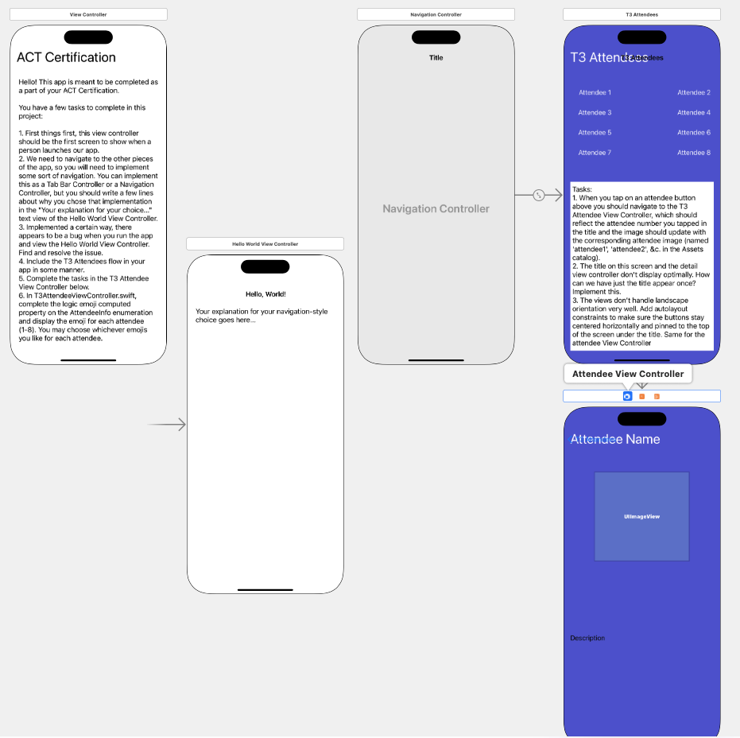

# T3 Debugging Homework

This project contains some homework that trainers are expected to complete for certification as trainers in App Development with Swift.

Open up the project in Xcode and go to the Main.storyboard. There are instructions and a series of tasks you're expected to complete, and some bugs to work around (or resolve).

This app is meant to be completed as a part of your ACT Certification.
You have a few tasks to complete in this project:
###Beginning
1. First things first, this view controller with the ACT Certification title text should be the first screen to show when a person launches our app.

###Step 2: Tie It All Together
1. We need to navigate to the other pieces of the app, so you will need to implement
some sort of navication from this first scene to the other view controllers in the storyboard. You can implement this as a Tab Bar Controller or a Navigation Controller, but you should write a few lines in the "Your explanation for your choice..." text view of the Hello World View Controller.
2. Implemented a certain way, there appears to be a bug when you run the app and view the Hello World View Controller. Find and resolve the issue.

###Step 3: Add the T3 Attendees Flow
1. Include the T3 Attendees flow in your app in some manner.

###Step 3: Finish the T3 Attendees Flow
1. When you tap on an attendee button above you should navigate to the T3 Attendee View Controller, which should reflect the attendee number you tapped in the title and the image should update with the corresponding attendee image (named `attendeel`, `attendee2`, &c. in the Assets catalog).
2. The title on this screen and the detail view controller don't display optimally. How can we have just the title appear once? Implement this.
3. The views don't handle landscape orientation very well. Add autolayout constraints to make sure the buttons stay centered horizontally and pinned to the top of the screen under the title. Same for the Attendee View Controller.
6. In the `T3AttendeeViewController.swift` file, complete the logic for the `emoji` computed property on the `AttendeeInfo`` enumeration and display the emoji for each attendee(1-8). You may choose whichever emojis you like for each attendee.

The final homework should be submitted by the end of the ACT Certification week to your Apple Mentor trainer.
